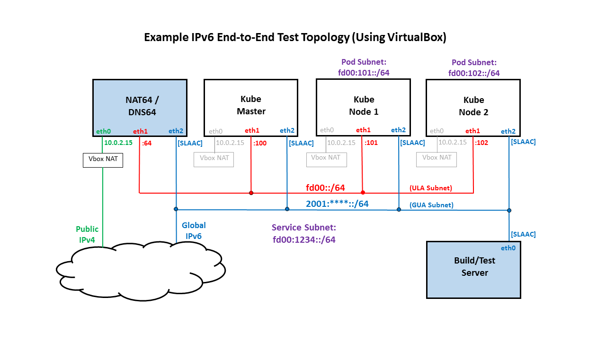

# kube-v6-test
This page describes a suite of Kubernetes e2e tests that will be used for Kubernetes IPv6 Continuous Integration (CI) testing, and can also be used for testing IPv6 networking conformance on an IPv6-only, multi-node Kubernetes cluster.

The test cases that are included in this suite are all "out-of-the-box" Kubernetes e2e test cases, that is, they are available upstream. Running this test suite is therefore a matter of providing the right test case filtering through the use of "--ginkgo.focus" and "--ginkgo.skip" regular expressions on the command line, as described in the [Kubernetes e2e test documentation](https://github.com/kubernetes/community/blob/master/contributors/devel/e2e-tests.md#end-to-end-testing-in-kubernetes), as well as a "--num-nodes=2" flag to run the Kubernetes services e2e tests that require 2 or more worker nodes.

Some of the steps described below assume the topology shown in the following diagram, but certainly various topologies can be tested with slight variations in the steps:



## The Evolving Test Suite
It is expected that the list of test cases that are included in this suite will grow over time to improve test coverage and make the testing more comprehensive. Some things to consider before adding a test case:
- Does the test work in an IPv6 cluster (is it debugged)?
- Is it a meaningful test of IPv6 functionality?
- Is it fairly quick to run? (important for keeping CI test queues reasonable)

## Disabling IPv4-Specific Test Cases for IPv6 Testing
If there is an IPv4-specific Kubernetes e2e networking test case that should be excluded from testing on an IPv6-only cluster, then the test should be marked as being an IPv4 test case by adding the following tag in the test description:
```
[Feature:Networking-IPv4]
```
For example, there is a 'ping 8.8.8.8' test that has been disabled for IPv6 testing as follows:
```
It("should provide Internet connection for containers [Feature:Networking-IPv4]", func() {
```
Any tests with this tag can be excluded from e2e testing by including "IPv4" as part of the --ginkgo.skip regular expression on the e2e test command line (see "e2e Test Command Line" below).

## Disabling IPv6-Specific Test Cases for IPv4-only Testing
Conversely, if there is an IPv6-specific Kubernetes e2e networking test case that should be excluded from testing on an IPv4-only cluster, then the test case should be marked with the following tag in the test description:
```
[Feature:Networking-IPv6][Experimental]
```
For example:
```
It("should provide Internet connection for containers [Feature:Networking-IPv6][Experimental]", func() {
```
Any test with this tag can be excluded from e2e testing by including "IPv6" as part of the --ginkgo.skip regular expression on the e2e test command line (see "e2e Test Command Line" below).

## Guidelines for Instantiating an IPv6-Only Kubernetes Cluster
For guidelines on how to instantiate an IPv6-only Kubernetes cluster refer to [kube-v6](https://github.com/leblancd/kube-v6) setup guidelines.

## Manually Running the IPv6 Multi-node e2e Test Suite on an IPv6-Only Kubernetes Cluster

#### If you haven't already done so, copy the kubernetes config file and the kubectl binary from your kube-master to a Linux host that will function as an external build/test server

The following assumes that you have password-less access to kube-master for user "kube" (but no scp access for root):
```
#!/bin/bash

KUBE_USER=kube
KUBE_MASTER=kube-master
echo ssh into $KUBE_MASTER and copy Kubernetes config and kubectl to $KUBE_USER home directory
ssh $KUBE_USER@$KUBE_MASTER << EOT
mkdir -p /home/kube/.kube
sudo yes | sudo cp -f /etc/kubernetes/admin.conf /home/$KUBE_USER/.kube/config
sudo chown $(id -u):$(id -g) /home/$KUBE_USER/.kube/config
sudo yes | sudo cp -f /bin/kubectl /home/$KUBE_USER/.kube
EOT

echo scp kubernetes config from $KUBE_MASTER to /home/$KUBE_USER/.kube/config
mkdir -p $HOME/.kube
scp $KUBE_USER@$KUBE_MASTER:/home/$KUBE_USER/.kube/config $HOME/.kube
chown $(id -u):$(id -g) $HOME/.kube/config
scp $KUBE_USER@$KUBE_MASTER:/home/$KUBE_USER/.kube/kubectl $HOME/.kube
sudo cp $HOME/.kube/kubectl /bin/kubectl
```
#### Confirm that you can access the Kubernetes API server from the build server using the kubectl client:
```
some-user@build-server:~$ kubectl get nodes
NAME            STATUS    ROLES     AGE       VERSION
kube-master     Ready     master    6d        v1.9.0-alpha.0.ipv6.0.1+23df37a5a1b7d7-dirty
kube-minion-1   Ready     <none>    6d        v1.9.0-alpha.0.ipv6.0.1+23df37a5a1b7d7-dirty
kube-minion-2   Ready     <none>    6d        v1.9.0-alpha.0.ipv6.0.1+23df37a5a1b7d7-dirty
some-user@build-server:~$ 
```
If you don't get a response, check that you've copied the Kubernetes config file correctly from the kube-master  to $HOME/.kube/config (previous step), and check that you have the required routes from your build node to the Kubernetes API service IP.

#### You should also be able to curl the Kubernetes API server from the build server:
```
some-user@build-server:~$ curl -g [fd00:1234::1]:443 | od -c -a
  % Total    % Received % Xferd  Average Speed   Time    Time     Time  Current
                                 Dload  Upload   Total   Spent    Left  Speed
100    14    0    14    0     0    265      0 --:--:-- --:--:-- --:--:--   269
0000000 025 003 001  \0 002 002  \n
        nak etx soh nul stx stx  nl
0000007
some-user@build-server:~$
```
If you don't get a response, check that you've have the required routes from your build node to the Kubernetes API service IP.

#### Running the tests
The e2e tests can be run as follows:
```
export KUBECONFIG=/home/openstack/.kube/config
export KUBE_MASTER=local
export KUBE_MASTER_IP="[fd00:1234::1]:443"
export KUBERNETES_CONFORMANCE_TEST=n
cd $GOPATH/src/k8s.io/kubernetes
go run hack/e2e.go -- --provider=local --v --test --test_args="--host=https://[fd00:1234::1]:443 --ginkgo.focus=Networking|Services --ginkgo.skip=IPv4|DNS|Federation|functioning\sNodePort|preserve\ssource\spod --num-nodes=2"
```
An explanation of some of the fields used in this command set:
```
- Kubernetes API Service IP:  fd00:1234::1
- INCLUDE test cases with the following phrases/words in their descriptions:
  - "Networking"
  - "Services"
- But EXCLUDE test cases with the following phrases/words in their descriptions:
  - "IPv4"
  - "DNS"
  - "Federation"
  - "functioning NodePort"
  - "preserve source pod"
- Number of worker nodes to use for testing: 2 (Min required for some service tests)
```

## Kubernetes IPv6 Continuous Integration (CI) Tests
There is a Kubernetes pull request that is up for review for introducing pre-commit and post-commit Kubernetes IPv6 CI test jobs:

https://github.com/kubernetes/test-infra/pull/7529

Once this PR is merged, the Kubernetes IPv6 CI test jobs will run the test suite that is described in this documentation.

## Included Test Cases
| Description | Sample<br>Test Time<br>(seconds)\* |
|-------------|-----------------------------------:|
| **Network Connectivity Test Cases** ||
| [It] *should function for node-pod communication: udp* [Conformance] | 63.557 |
| [It] *should function for node-pod communication: http* [Conformance] | 61.757 |
| [It] *should function for intra-pod communication: http* [Conformance] | 55.885 |
| [It] *should function for intra-pod communication: udp* [Conformance] | 59.329 |
| [It] *should provide unchanging, static URL paths for kubernetes api services* | 9.420 |
| **Services Test Cases** ||
| [It] *should function for pod-Service: udp* | 66.270 |
| [It] *should be able to change the type from ExternalName to ClusterIP* | 8.993 |
| [It] *should update endpoints: udp* | 149.118 |
| [It] *should be able to change the type from ClusterIP to ExternalName* | 9.112 |
| [It] *should update nodePort: udp* [Slow] | 167.113 |
| [It] *should function for node-Service: http* | 68.807 |
| [It] *should check NodePort out-of-range* | 9.091 |
| [It] *should be able to change the type from ExternalName to NodePort* | 9.079 |
| [It] *should check kube-proxy urls* | 62.688 |
| [It] *should function for pod-Service: http* | 86.556 |
| [It] *should use same NodePort with same port but different protocols* | 9.205 |
| [It] *should serve multiport endpoints from pods* [Conformance] | 74.567 |
| [It] *should update nodePort: http* [Slow] | 152.895 |
| [It] *should release NodePorts on delete* | 17.233 |
| [It] *should be able to change the type from NodePort to ExternalName* | 9.308 |
| [It] *should function for node-Service: udp* | 91.738 |
| [It] *should update endpoints: http* | 155.233 |
| [It] *should prevent NodePort collisions* | 9.892 |
| [It] *should transfer ~ 1GB onto the service endpoint 1 servers (maximum of 1 clients)* | 68.287 |
| [It] *should provide secure master service* [Conformance] | 9.044 |
| [It] *should be able to update NodePorts with two same port numbers but different protocols* | 6.273 |
| [It] *should create endpoints for unready pods* | 27.295 |
| [It] *should function for endpoint-Service: http* | 73.971 |
| [It] *should function for endpoint-Service: udp* | 82.004 |
| [It] *should serve a basic endpoint from pods* [Conformance] | 61.248 |
| [It] *should function for client IP based session affinity: http* | 85.018 |
|--------------------------------------------------------------- **TOTAL TEST TIME:** | **30 min 20 secs** |

\* Sample test times are a rough guideline. These test times were taken on a fairly slow virtualized Kubernetes cluster: CentOS VirtualBox guests on an Ubuntu 16.04 host.

## Failing Tests that are Being Investigated
| Test Area | Description | Comment/Issue |
|:---------:|-------------|---------|
| **DNS** | [It] *should provide DNS for services* [Conformance] | https://github.com/kubernetes/kubernetes/issues/62883 |
| **Network Connectivity** | [It] *should provide Internet connection for containers*<br>[Feature:Networking-IPv6][Experimental] | Intermittently failing. Could be collateral damage from a kube-dns crash loop |

## Tests that Are Being Skipped Since They are not Appropriate
| Test Area | Description | Comment |
|:---------:|-------------|---------|
| **Services** | [It] *should preserve source pod IP for traffic thru service cluster IP* | Masquerading is enabled in Bridge CNI plugin, so pod source IPs will not be preserved |
| **Services** | [It] *should be able to create a functioning NodePort service* | For testing on a GCE instance, only IPv4 external IPs are available. Therefore, stateless NAT46 would be required to test NodePort service on an IPv6-only cluster using an external, IPv4 address. |

## Wish List (Failing/New Tests That Would be Good to Have Fixed/Added)
| Test Area | Description |
|:---------:|-------------|
| **Service<br>LoadBalancer** | [It] *should support simple GET on Ingress ips* [Feature:ServiceLoadBalancer] |
| **NEW TEST TO<br>BE WRITTEN** | [It] *should support kube-dns probes of type SRV* [Feature:KubeDNS] |
